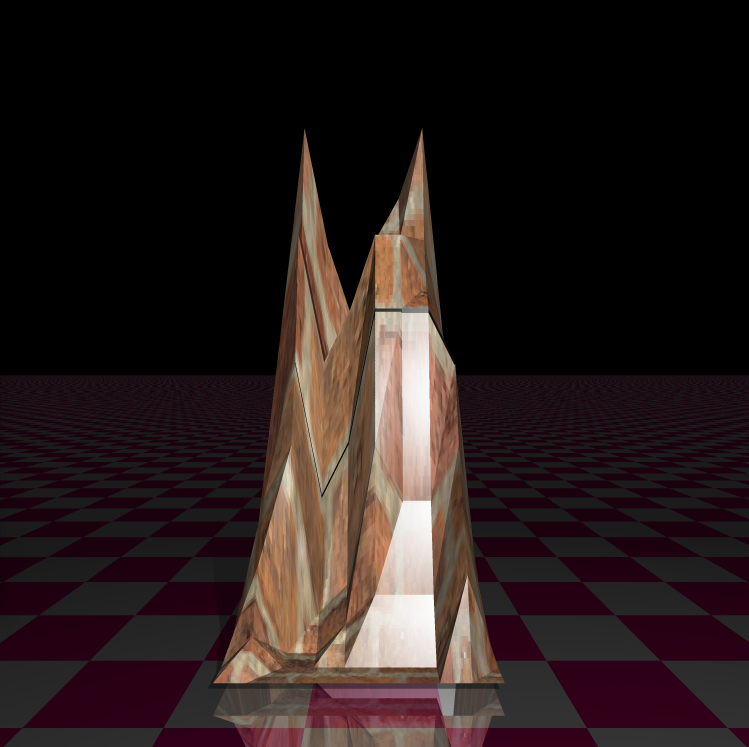

# RT
This is a somewhat complex raytracing implementation. It supports  reflection, transparency, light spots, multiple light sources, complex objects, textures, CPU multi-threading, and soft shadows.

Click on video below:

